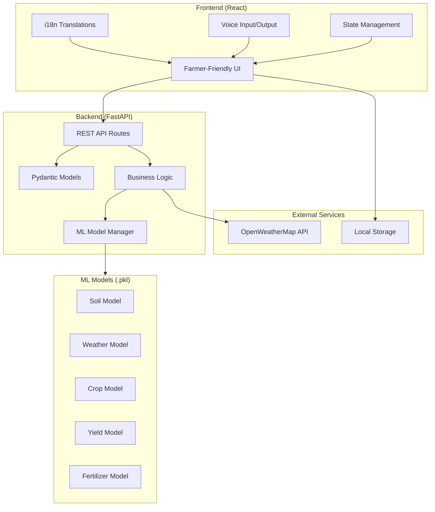

# � AI-Driven Crop Recommendation and Growth Prediction System

> **Using Soil Fertility and Climate Intelligence**

**Agri-Smart Precision Platform** - Production-Ready Agricultural Advisory System with PWA & Gemini AI

[](https://python.org)
[](https://reactjs.org)
[](https://fastapi.tiangolo.com)
[](https://ai.google.dev)
[](https://web.dev/progressive-web-apps/)
[](LICENSE)

## 📋 Table of Contents

- [Overview](#overview)
- [Features](#features)
- [Technology Stack](#technology-stack)
- [System Architecture](#system-architecture)
- [Installation](#installation)
- [API Endpoints](#api-endpoints)
- [Usage Guide](#usage-guide)
- [Project Structure](#project-structure)
- [Contributing](#contributing)

## 🎯 Overview

The Agricultural Intelligence System is a comprehensive AI-powered platform designed to help Indian farmers make data-driven decisions. It combines machine learning models with real-time weather data and Google Gemini AI to provide actionable insights for:

- **Soil Health Analysis** - NPK-based fertility assessment with recommendations
- **Weather Risk Prediction** - Flood and drought forecasting with climate intelligence
- **Crop Recommendation** - AI-powered crop selection (98.2% accuracy)
- **Yield Estimation** - Production and profit prediction
- **Fertilizer Advisory** - Customized fertilizer recommendations
- **Gemini AI Chatbot** - Context-aware, bilingual farming assistant
- **Auto-Location Detection** - Browser geolocation for automatic weather
- **PWA Support** - Offline-first progressive web app

## ✨ Features

### 🧪 5 AI Prediction Modules

| Module | Description | Input | Output |
|--------|-------------|-------|--------|
| Soil Fertility | Analyzes soil health | N, P, K values | Fertility status & recommendations |
| Weather Risk | Predicts weather hazards | Month, Temperature | Flood/Drought risk level |
| Crop Recommendation | Suggests optimal crops | Soil & climate data | Best crop with growing tips |
| Yield Prediction | Estimates production | Farm details | Expected yield in tons |
| Fertilizer Advisory | Recommends fertilizers | Soil deficiencies | Fertilizer type & dosage |

### 🌐 Bilingual Support

- **English** (en)
- **Hindi** (हिन्दी)
- **Telugu** (తెలుగు)
- **Tamil** (தமிழ்)
- **Kannada** (ಕನ್ನಡ)

### 🤖 Advanced AI Features

- **Gemini AI Integration** - Google's latest language model for intelligent conversations
- **Context-Aware Chat** - Remembers conversation history and farmer profile
- **Multilingual AI** - Responds in Hindi, Telugu, Tamil, Kannada
- **Automatic Fallback** - Switches to rule-based chatbot if API unavailable

### 📱 Progressive Web App (PWA)

- **Offline Support** - Full functionality without internet
- **Installable** - Add to home screen on any device
- **Push Notifications** - Weather alerts and farming tips
- **Background Sync** - Syncs predictions when connection restored
- **Fast Loading** - Service worker caching strategies

### 🌍 Location Features

- **Auto-Detection** - One-click location detection using browser geolocation
- **Reverse Geocoding** - Converts coordinates to readable location names
- **Weather Auto-Fill** - Automatically fetches weather for detected location
- **Permission Handling** - Clear prompts and error messages

### 🎤 Voice Features

- Speech-to-text input for hands-free operation
- Text-to-speech output for results
- Language-specific voice recognition

### 🛡️ Security & Performance

- **Rate Limiting** - 100 requests/minute (10 for predictions)
- **Security Headers** - XSS, CSRF, Clickjacking protection
- **GZip Compression** - Automatic response compression
- **Request Logging** - Complete audit trail
- **Environment-Based CORS** - Secure origin control

### 📱 Farmer-Friendly UI

- High contrast design for outdoor visibility
- Large buttons for easy touch interaction
- Icon-based navigation
- Offline capability (PWA)
- Responsive design for all screen sizes

## 🛠 Technology Stack

### Backend
- **FastAPI** - High-performance Python web framework
- **Pydantic** - Data validation with Python type hints
- **Scikit-learn** - Machine learning models
- **Pandas/NumPy** - Data processing
- **OpenWeatherMap API** - Real-time weather data

### Frontend
- **React 19** - Modern UI library
- **Material-UI** - Component library
- **Axios** - HTTP client
- **React Router** - Navigation
- **Web Speech API** - Voice features

### ML Models
- Random Forest Classifier (Crop Recommendation)
- XGBoost (Weather Risk Prediction)
- Gradient Boosting (Yield Prediction)
- Decision Tree (Fertilizer Advisory)

## 🏗 System Architecture



## 📦 Installation

### Prerequisites

- Python 3.8+
- Node.js 16+
- npm or yarn

### Quick Start

1. **Clone the repository**
```bash
git clone https://github.com/Udvikanth10/MiniProject.git
cd MiniProject
```

2. **Set up Backend**
```bash
# Create virtual environment
python -m venv .venv

# Activate virtual environment
# Windows:
.venv\Scripts\activate
# Linux/Mac:
source .venv/bin/activate

# Install dependencies
pip install -r backend/requirements.txt

# Start backend server
cd backend
uvicorn main_v2:app --reload --host 0.0.0.0 --port 8000
```

3. **Set up Frontend**
```bash
# Navigate to frontend
cd Frontend

# Install dependencies
npm install

# Start development server
npm start
```

4. **Access the Application**
- Frontend: http://localhost:3000
- Backend API: http://localhost:8000
- API Documentation: http://localhost:8000/docs

### Using Batch Files (Windows)

```bash
# Start everything with one click
START_APPLICATION.bat
```

## 🔌 API Endpoints

### Health & Status
| Endpoint | Method | Description |
|----------|--------|-------------|
| `/health` | GET | Health check |
| `/status` | GET | System status with model info |

### Predictions
| Endpoint | Method | Description |
|----------|--------|-------------|
| `/api/predict/soil` | POST | Soil fertility analysis |
| `/api/predict/weather` | POST | Weather risk prediction |
| `/api/predict/crop` | POST | Crop recommendation |
| `/api/predict/yield` | POST | Yield prediction |
| `/api/predict/fertilizer` | POST | Fertilizer advisory |
| `/api/predict/unified` | POST | Complete farm analysis |

### Weather
| Endpoint | Method | Description |
|----------|--------|-------------|
| `/api/weather/current` | GET | Current weather data |
| `/api/weather/by-state/{state}` | GET | Weather by Indian state |
| `/api/weather/farming-advice` | GET | Farming advice from weather |

### Chatbot
| Endpoint | Method | Description |
|----------|--------|-------------|
| `/api/chat/message` | POST | Send chat message |
| `/api/chat/quick-questions` | GET | Get suggested questions |

### Settings
| Endpoint | Method | Description |
|----------|--------|-------------|
| `/api/settings/profile` | POST/GET | Farmer profile management |
| `/api/settings/preferences/{id}` | PUT/GET | User preferences |

## 📖 Usage Guide

### 1. Initial Setup

1. Open the application
2. Go to **Settings** page
3. Select your preferred language
4. Enter your location (state) for weather data
5. Optionally enable GPS for precise weather

### 2. Soil Analysis

1. Navigate to **Soil Fertility** module
2. Enter NPK values from your soil health card:
   - Nitrogen (N): 0-200 mg/kg
   - Phosphorus (P): 0-200 mg/kg
   - Potassium (K): 0-300 mg/kg
3. Click "Analyze" to get results

### 3. Crop Recommendation

1. Go to **Crop Recommendation** module
2. Enter soil and weather data
3. Click "Recommend" to get the best crop

### 4. Using the Chatbot

1. Click the chat icon (bottom-right)
2. Type or speak your question
3. Use quick questions for common queries
4. The bot understands context from your analysis

## 📁 Project Structure

```
MiniProject/
├── backend/
│   ├── api/
│   │   └── routes/
│   │       ├── settings.py      # Farmer profile routes
│   │       ├── predict.py       # ML prediction routes
│   │       ├── weather.py       # Weather API routes
│   │       ├── chatbot.py       # Chat routes
│   │       └── health.py        # Health check routes
│   ├── models/
│   │   ├── farmer.py            # Pydantic farmer models
│   │   ├── prediction.py        # Prediction I/O models
│   │   └── chat.py              # Chat models
│   ├── ml_models/
│   │   └── model_manager.py     # ML model loading
│   ├── services/
│   │   ├── weather_service.py   # Weather API integration
│   │   ├── prediction_service.py# ML inference logic
│   │   ├── chatbot_service.py   # Chatbot logic
│   │   └── farmer_service.py    # Farmer data management
│   ├── main_v2.py               # FastAPI application
│   └── requirements.txt
├── Frontend/
│   └── src/
│       ├── components/
│       │   ├── ui/              # Farmer-friendly UI components
│       │   ├── Navbar.js
│       │   ├── Sidebar.js
│       │   ├── ChatWidget.js
│       │   └── AdvancedChatbot.js
│       ├── pages/
│       │   ├── Home.js
│       │   ├── SoilFertility.js
│       │   ├── WeatherIntelligence.js
│       │   ├── CropRecommendation.js
│       │   ├── YieldPrediction.js
│       │   ├── FertilizerAdvisory.js
│       │   ├── UnifiedDashboard.js
│       │   ├── ChatbotPage.js
│       │   └── SettingsPage.js
│       ├── hooks/
│       │   ├── useSettings.js
│       │   ├── useWeather.js
│       │   ├── useTranslation.js
│       │   ├── useVoice.js
│       │   └── usePrediction.js
│       ├── i18n/
│       │   └── translations.js  # Multi-language strings
│       ├── store/
│       │   └── AppContext.js    # Global state
│       └── App.js
├── models/                      # ML pickle files
├── Data/                        # Datasets
├── docs/                        # Documentation
│   ├── architecture.md
│   ├── user_guide.md
│   └── api_spec.md
├── PROMPT.md                    # Project specification
└── README.md                    # This file
```

## 🤝 Contributing

1. Fork the repository
2. Create a feature branch (`git checkout -b feature/AmazingFeature`)
3. Commit changes (`git commit -m 'Add AmazingFeature'`)
4. Push to branch (`git push origin feature/AmazingFeature`)
5. Open a Pull Request

## 📄 License

This project is licensed under the MIT License - see the [LICENSE](LICENSE) file for details.

## 🙏 Acknowledgments

- OpenWeatherMap for weather API
- Indian Agricultural Research Institute for domain knowledge
- React and FastAPI communities

---

**Made with ❤️ for Indian Farmers**

*🌾 Helping farmers grow smarter, one prediction at a time.*
